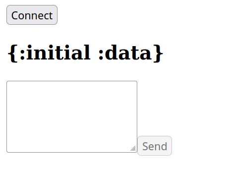

# spa-ws-template

This project is an example of a [Reagent](https://github.com/reagent-project/reagent)/[ReFrame](https://github.com/Day8/re-frame)
frontend together with [http-kit](https://github.com/http-kit/http-kit) as a server and a websocket with
[sente](https://github.com/ptaoussanis/sente).

### Getting started

To install the required JS libraries you need to (once) run:
```bash
yarn install
```

To start [shadow-cljs](https://github.com/thheller/shadow-cljs) and get a cljs repl do.
```clj
(require '[shadow.cljs.devtools.api :as shadow]
         '[shadow.cljs.devtools.server :as server])

(server/start!)
(shadow/watch :app)
(shadow/repl :app)
```
To start the server on port 5000
```clj
(require '[io.dbme.server :as server])

(server/start!)
```

You should then be able to see the frontend at [localhost:5000](http://localhost:5000).

If you are using [CIDER](https://github.com/clojure-emacs/cider) you can also just jack-in via
`cider-jack-in-clj&cljs`.

### Sending stuff over the websocket.

The frontend then should look something like

.

Once you connect, you should see a log message in your clj repl telling you that a connection
has been established.

Now you are able to send stuff over the websocket connection. You can add some clojure data in the send
field, for example `{:hello :world}`. Once you hit send you should once again see a log message
with the data in your server repl.

For sending stuff from server to client you can look at the [socket](src/io/dbme/socket.clj) namespace.
```clj
(require '[io.dbme.socket :as socket])

(send-data {:some-new-data true})
```
The data you send is then displayed above the send field in the frontend.

Happy hacking!

## License

MIT Licence
